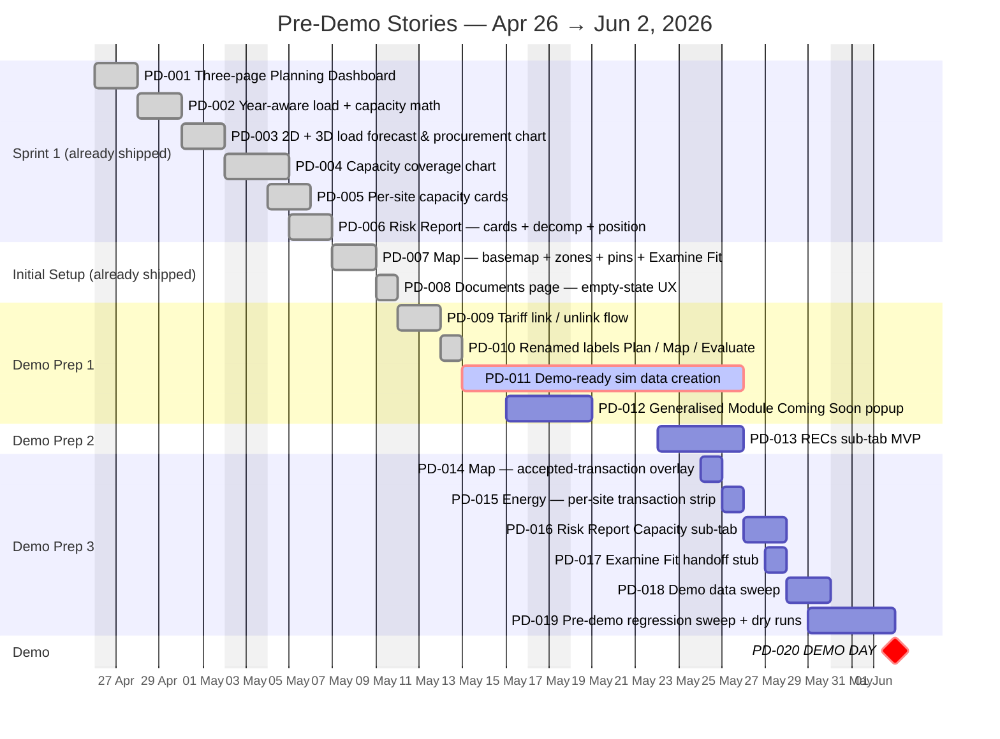
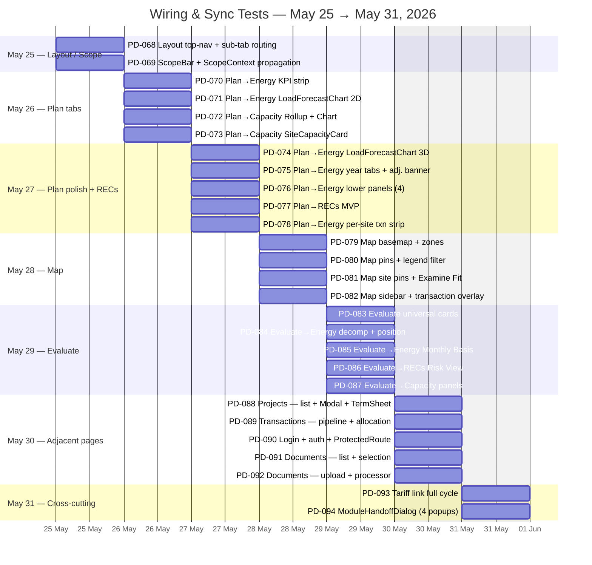

# Pre-Demo Planning Module — Gantt & Backlog

**Demo Day: Tuesday, 2 June 2026.**

The whole pre-demo period runs on **canned/sim data** (locked in `PD-011`) — zero live data, zero backend API, zero Profiling-handoff work is due before the demo. That post-demo work moves to June/July (see `docs/PLANNING_MODULE_ROADMAP.md`). The trade-off is deliberate: predictability and consistent demo-day UI behaviour over real-data realism.

Everything below maps 1:1 to the JIRA tickets in `docs/JIRA_powerdime_import.csv`.

---

## Pre-Demo Stories (PD-001 → PD-019) + Demo Day (PD-020)

---

## Wiring & Sync Test Sub-tasks (PD-068 → PD-094)

Every visible feature has a paired wiring & sync test that runs after its build Story is complete. The acceptance criterion is universal: **feature sync wiring completed end-to-end + sync testing completed with 0 errors and 0 unexpected results.**

---

## Story Topics + Their Sub-tasks

### Sprint 1 — Already shipped

| Story | Description | Wiring sub-tasks |
|-------|-------------|------------------|
| **PD-001** Three-page Planning Dashboard | Plan / Map / Evaluate routes, persistent scope header, Capacity / Energy / RECs sub-tab row, cross-page state preservation. | PD-068 (top-nav + sub-tabs), PD-069 (ScopeBar), PD-088 (Projects), PD-089 (Transactions), PD-090 (Login + auth) |
| **PD-002** Year-aware load + capacity math | LoadAdjustment + CapacityByYear types, getEffectiveLoadAt + getSiteCapacityForYear helpers, single-site + aggregate paths. The Manassas +25% Jul 2027 demo bump propagates through every consumer. | (math layer — covered by chart wiring tests below) |
| **PD-003** 2D + 3D load forecast & procurement chart | Plan→Energy chart: per-hour or per-month bars with teal baseload + amber peak tier shading, per-contract patterns, oblique ribbon 3D mode, over-hedge below y=0. | PD-070 (KPI strip), PD-071 (2D mode), PD-074 (3D ribbon), PD-075 (year tabs + adj. banner), PD-076 (lower panels) |
| **PD-004** Capacity coverage chart | Plan→Capacity indigo capacity bar with per-source SVG patterns. Bar height steps year-over-year for documented expansions. | PD-072 (Rollup + Chart pipeline) |
| **PD-005** Per-site capacity cards | Brownfield BRA panel + greenfield options table per site. View Document / Solicit RFQ / View BRA History dialogs. | PD-073 (SiteCapacityCard panels + dialogs) |
| **PD-006** Risk Report — cards + decomp + Contracted Position | Evaluate page: 5 summary cards, 5-row risk decomposition table, per-site Contracted Position bars. Year-tab synchronises headline cards with chart. | PD-083 (universal cards), PD-084 (decomp + position), PD-085 (Monthly Basis), PD-086 (RECs Risk View), PD-087 (Capacity panels) |

### Initial Setup — Already shipped

| Story | Description | Wiring sub-tasks |
|-------|-------------|------------------|
| **PD-007** Map — basemap, zones, pins, Examine Fit | OSM basemap, PJM zone overlay, project pins by gen type, buyer site pins, Examine Fit ribbon. | PD-079 (basemap + zones), PD-080 (pins + legend), PD-081 (site pins + Examine Fit) |
| **PD-008** Documents page UX | Graceful empty state on backend failure (no scary red banner). Console diagnostic preserved for devs. | PD-091 (list + selection), PD-092 (upload + processor) |

### Demo Prep 1

| Story | Description | Wiring sub-tasks |
|-------|-------------|------------------|
| **PD-009** Tariff link / unlink flow | View Document on Capacity card opens linked tariff or routes to Documents in selection mode. localStorage-persisted. | PD-093 (tariff link full cycle) |
| **PD-010** Renamed labels — Plan / Map / Evaluate | User-facing rename: Forecast → Plan, Risk → Evaluate; Hedge Coverage → Contracted Coverage; Hedge Position → Contracted Position. | (label-only — covered by Layout wiring test PD-068) |
| **PD-011** Demo-ready sim data creation  IN FLIGHT | Lock the demo dataset as TypeScript constants under `src/data/`. 3 DOM sites with full profile, capacity expansions, mid-year load bumps, staggered contracts, BRA capacity sources, LMP basis bands, site financials. **This is the foundation that lets the demo run with zero backend dependency.** | (foundational — every wiring test below verifies the sim data renders correctly) |
| **PD-012** Generalised Module Coming Soon popup | Generalise `ComingSoonDialog` into a top-level `ModuleHandoffDialog` with module name + completion target + payload preview. Wired to every CTA that crosses an unfinished module boundary. | PD-094 (4-popup set: Solicit RFQ / Examine Fit / View BRA / Accept Txn) |

### Demo Prep 2

| Story | Description | Wiring sub-tasks |
|-------|-------------|------------------|
| **PD-013** RECs sub-tab MVP | Per-site target % + current REC coverage % + gap MWh + annual ESG cost. Annual matching only — full time-matching is post-demo. Plan→RECs and Map→RECs both render real content (not "coming soon"). | PD-077 (Plan→RECs MVP), PD-086 (Evaluate→RECs Risk View) |

### Demo Prep 3

| Story | Description | Wiring sub-tasks |
|-------|-------------|------------------|
| **PD-014** Map — accepted-transaction overlay | Connector lines from each contracted project pin to the buyer site(s) it hedges, one per `perSiteMw` entry. Hover popup names the contract, MW, term. | PD-082 (sidebar + fly-to + transaction overlay) |
| **PD-015** Energy — per-site transaction summary strip | One-line strip per site listing every accepted transaction (project · MW · shape · term). Sits between KPI strip and load chart. | PD-078 (per-site txn strip) |
| **PD-016** Risk Report Capacity sub-tab | Build out the scaffolded panel: Capacity-cost summary card, BRA volatility band, Fixed-term-vs-pass-through comparison. | PD-087 (Capacity panels) |
| **PD-017** Examine Fit handoff stub | Wire the Map's Examine Fit primary CTA to `ModuleHandoffDialog` with a documented Contracting payload schema visible on hover. | (handoff — covered by PD-094 popup wiring test) |
| **PD-018** Demo data sweep | Lock the demo storyline. Confirm same data renders identically before / after migration to live (post-demo). Demo script written referencing concrete numbers. | (data lock — covered by regression sweep PD-019) |
| **PD-019** Pre-demo regression sweep + dry runs | Smoke-test full Planning Module against locked sim fixtures (PD-011): scope changes, year tabs, site (de)selection, contract term boundaries, mid-year bump, capacity step-ups, over-hedge rendering, every popup fires. Two clean dry-runs. | (top-level regression — wraps every wiring test) |

### Demo Day

| Story | Description |
|-------|-------------|
| **PD-020 — DEMO DAY**  | Live demo. Walk Pillars 1, 2, 3 in order. Demonstrate scope/duration control, 4D math through year tabs, Map filter + accepted-transaction overlay, Risk Report P10/P50/P90, Solicit RFQ → completion-date popup. |

---

## What's NOT in this Phase (intentional punts)

These were on earlier versions of this Gantt and have moved to post-demo (June/July) so the pre-demo period stays predictable:

- **PD-023** DB Foundation schema — moved to **June 8–15**
- **PD-025** Backend API v1 — moved to **June 15 – July 3**
- **PD-033** Profiling Module → Planning Module live data interface — moved to **July 6–24**
- **PD-040** Demo-mode feature flag — moved to **July 27–31**

The full post-demo backlog (Jun 5 → Dec 31, including Contracting Module integration, 3-ISO live data ingestion, ML risk engine, and beta customer pilots) is in `docs/PLANNING_MODULE_ROADMAP.md` and as JIRA-importable rows in `docs/JIRA_powerdime_import.csv`.

---

## Pre-Demo Counts

| Sprint | Stories | Sub-tasks |
|--------|:-------:|:---------:|
| Sprint 1 | 6 | 0 |
| Initial Setup | 2 | 0 |
| Demo Prep 1 | 4 | 0 |
| Demo Prep 2 | 1 | 0 |
| Demo Prep 3 | 6 | 27 |
| **Total before Demo Day** | **19** | **27** |
| Demo Day milestone | 1 | — |
